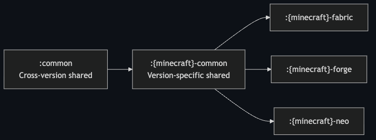
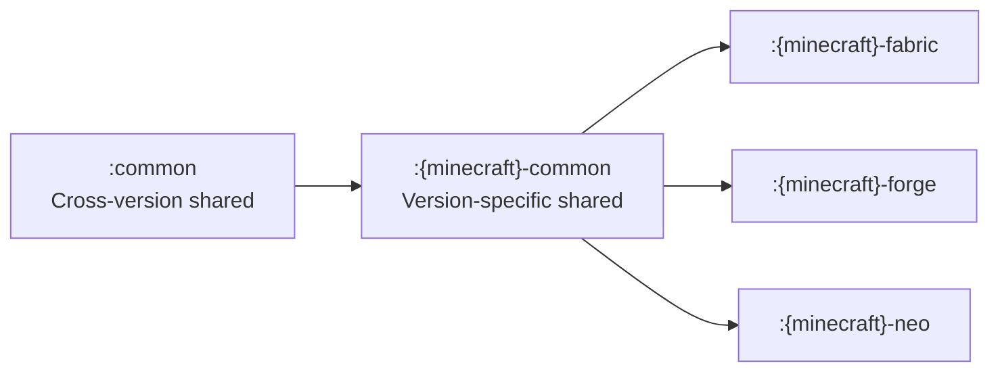
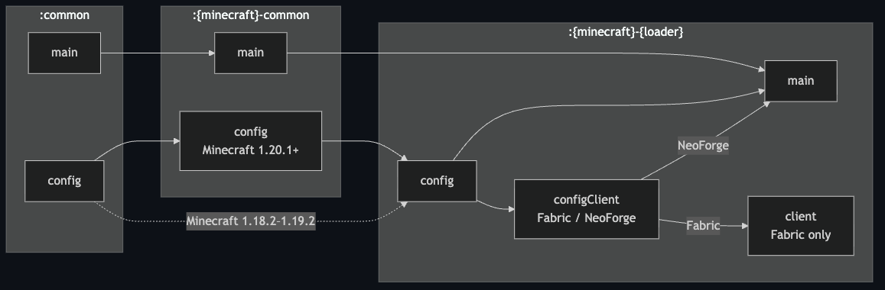
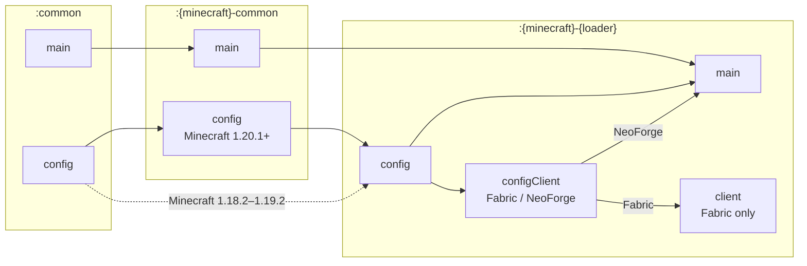

# custom-mdk template guide

A Minecraft mod template for multi-version and multi-loader development, powered by a single Gradle multi-project build. It includes Kotlin DSL build logic, shared source sets, Mixin support, Parchment mappings where available, generated mod metadata, versioned artifact names, Java toolchain management, runtime mod staging, and GitHub Actions for build workflows.

## Supported Platforms

| Minecraft | Fabric | LexForge | NeoForge | Quilt |
|-----------|:------:|:--------:|:--------:|:-----:|
| <1.18.2   |   🚫   |    🚫    |    -     |  🚫   |
| 1.18.2    |   ✅   |    ✅    |    -     |  🚫   |
| 1.19.2    |   ✅   |    ✅    |    -     |  🚫   |
| 1.20.1    |   ✅   |    ✅    |    🚫    |  🚫   |
| 1.21.1    |   ✅   |    ✅    |    ✅    |  🚫   |
| 1.21.8    |   ✅   |    ✅    |    ❌    |  🚫   |
| 1.21.11   |   ✅   |    ✅    |    ❌    |  🚫   |
| 26.1      |   ✅   |    ❌    |    ✅    |  🚫   |
| 26.1.2    |   🌟   |    ❌    |    🌟    |  🚫   |
| 26.2      |   ✅   |    🚫    |    ✅    |  🚫   |

🌟 Primary support | ✅ Supported | 🚧 Partial support | ⏳ Planned | ❌ Not supported yet | 🚫 Unsupported

Only the subprojects included in `settings.gradle.kts` are configured. Comment out unused `include(...)` lines when you do not need a version or loader.

LLM agents and automation should also read [MDK Agent Notes](mdk/README.md) before editing this template.

## Project Layout

- `common`: shared Java code used by every supported target.
- `<minecraft>/common`: version-specific shared code. Older versions use the LexForge Legacy toolchain; 1.21+ and 26.x use NeoForm through NeoForge ModDev.
- `<minecraft>/fabric`: Fabric loader project.
- `<minecraft>/forge`: LexForge loader project. ForgeGradle 7+ targets use `lexforge-*` conventions; older targets use `lexforge-legacy-*` conventions.
- `<minecraft>/neo`: NeoForge loader project.
- `src/config`: config-related common code that is packaged into the jar but kept out of the default main source set.
- `src/configClient`: client-only config screen helpers for loaders that expose a config UI.
- `buildSrc`: convention plugins that define loader-specific Gradle behavior.
- `gradle.properties`: mod metadata shared by generated `mods.toml`, `neoforge.mods.toml`, and `fabric.mod.json` files.
- `version.txt`: the mod version used for project versions, artifact names, and generated metadata.

### Project Dependencies

Arrows point from shared code to the projects that consume it. The available
loader projects vary by Minecraft version, as shown in the supported platform
table above.



<details>
<summary>Mermaid source for the image above</summary>



</details>

## Setup

Before opening or importing the project in IntelliJ IDEA or Gradle, trim `settings.gradle.kts`: each included project adds Gradle configuration and IDE import load time. Comment out any unused `include(...)` lines first.

1. Click **Use this template** on GitHub to create your repository from this template.
2. If you want to keep receiving template updates, follow
   [Receiving Upstream Updates](#receiving-upstream-updates) before regular development.
3. Edit `settings.gradle.kts` and comment out unused `include(...)` lines to reduce Gradle configuration time and cache usage.
4. Edit `gradle.properties` for your mod id, name, group, license, authors, URLs, and Fabric entry points, and edit `version.txt` for your mod version.
5. Rename ALL Java package names (including those in the shared configuration system) to avoid conflicts with other mods. Update `Constants`, entry points, mixin config names, and language assets from `examplemod` to your mod id.
6. Create a root `README.md` and `LICENSE` for your mod. Keep `docs/*.md` unchanged if you want future template updates to merge cleanly.

## Generated Metadata

Fabric `fabric.mod.json` files are generated from shared values in `gradle.properties`, `version.txt`, and the Fabric convention plugin. The convention provides common fields such as the mod id, version, authors, contact URLs, environment, entry points, Java requirement, Minecraft requirement, Fabric API dependency, and optional Forge Config API Port dependency.

Each `<minecraft>/fabric/src/main/templates/fabric.mod.json` file is a small override JSON. Values written there are merged over the generated defaults, so use it for target-specific metadata or extra dependencies without duplicating the common metadata. Nested objects such as `depends` are merged recursively.

## Requirements

- JDK 25 is recommended for configuring Gradle and matches the GitHub Actions build environment.
- Gradle downloads the toolchain needed by each Minecraft version through Foojay Toolchain Resolver.
- Version targets currently compile with:
  - Java 17: `common`, `1.18.2`, `1.19.2`, `1.20.1`
  - Java 21: `1.21.1`, `1.21.8`, `1.21.11`
  - Java 25: `26.1`, `26.1.2`

## Building

Build every included subproject on macOS or Linux:

```sh
./gradlew build
```

On Windows:

```sh
./gradlew.bat build
```

Build a specific platform:

```sh
./gradlew :26.1.2-fabric:build
./gradlew :26.1.2-neo:build
```

Artifacts are written under each configured project directory, such as `26.1.2/fabric/build/libs/`. Additional runtime-only mod jars declared through `ciRuntimeMods` are collected under that project directory's `build/ciRuntimeMods/` for CI.

## Running

Run a client:

```sh
./gradlew :26.1.2-fabric:runClient
./gradlew :26.1.2-neo:runClient
```

Run a server:

```sh
./gradlew :26.1.2-fabric:runServer
./gradlew :26.1.2-neo:runServer
```

## Dependencies

Use `gradle/libs.versions.toml` for shared dependency aliases, and keep target
versions in the affected subproject's `gradle.properties`.

Use `req(version)` for normal version requests and `pin(version)` only when
Gradle must reject any other selected version:

```kotlin
import net.meatwo310.mdk.build.req

val modmenuVersion: String by project

dependencies {
    modRuntimeOnly(libs.modmenu, req(modmenuVersion))
    // Exactly the same as:
    //   modRuntimeOnly(libs.modmenu) { version { require(modmenuVersion) } }
}
```

Choose the dependency configuration by what needs the dependency:

| Need | Fabric 1.21.11 and older | Fabric 26.1 and newer | LexForge Legacy | LexForge | NeoForge |
|------|---------------------------|------------------------|-----------------|----------|----------|
| Code imports dependency classes | `modImplementation(...)` | `implementation(...)` | `implementation(...)` | `implementation(...)` | `implementation(...)` |
| Local `runClient` / `runServer` only | `modRuntimeOnly(...)` | `runtimeOnly(...)` | `modRuntimeOnly(...)` | `runtimeOnly(...)` | `runtimeOnly(...)` |
| GitHub Actions runtime test must install the jar | `ciRuntimeMods(...)` | `ciRuntimeMods(...)` | `ciRuntimeMods(...)` | `ciRuntimeMods(...)` | `ciRuntimeMods(...)` |
| Code imports it and CI must install it | compile dependency plus `ciRuntimeMods(...)` | compile dependency plus `ciRuntimeMods(...)` | compile dependency plus `ciRuntimeMods(...)` | compile dependency plus `ciRuntimeMods(...)` | compile dependency plus `ciRuntimeMods(...)` |

`ciRuntimeMods` does not affect local `runClient` / `runServer` classpaths. It only stages direct jar
files into each configured project directory's `build/ciRuntimeMods` for the GitHub Actions runtime
test. Production loader metadata is also separate: add Fabric `depends`,
LexForge `mods.toml` dependencies, or NeoForge `neoforge.mods.toml`
dependencies only when users must install the dependency with the released mod.

## Configuration System

Shared config entries live in `common/src/config/java/.../config`. Define entries with `ConfigEntryBuilder`, collect them as `ConfigEntries`, and expose each file through a `ConfigDeclaration` in `ModConfigs`.

Config support is split into dedicated source sets so projects that do not opt into the config conventions can avoid resolving the extra config dependencies. Shared config declarations belong in `common/src/config`, version-specific config code belongs in `<minecraft>/common/src/config`, loader bindings belong in `<minecraft>/<loader>/src/config`, and client-only config screen helpers belong in `<minecraft>/<loader>/src/configClient`.

The source sets follow the same project hierarchy. The dotted edge is the
legacy path used when no version-specific `config` source set exists.



<details>
<summary>Mermaid source for the image above</summary>



</details>

For readability, the config edges show the logical layering. The conventions
add every available upstream `config` output directly to the downstream
classpath and jar.

Fabric creates `configClient` and wires it into `client`; the source set is
empty on older targets that do not provide client config helpers. NeoForge
wires `configClient` into `main`. LexForge does not create either of these
client-specific source sets.

Apply the matching config convention plugin in addition to the normal loader convention when a project needs config support:

| Project type | Config convention |
|--------------|-------------------|
| `common` | `common-config-conventions` |
| LexForge Legacy version common | `lexforge-legacy-common-config-conventions` |
| NeoForge version common | `neoforge-common-config-conventions` |
| LexForge Legacy loader project | `lexforge-legacy-config-conventions` |
| LexForge loader project | `lexforge-config-conventions` |
| Fabric loader project (1.20.1+) | `fabric-config-conventions` |
| Fabric Legacy loader project (1.18.2-1.19.2) | `fabric-legacy-config-conventions` |
| NeoForge loader project | `neoforge-config-conventions` |

These conventions wire the `config` and `configClient` outputs into the jar and into the appropriate compile/runtime classpaths. Fabric and LexForge config projects also add Forge Config API Port to their compile classpath, `ciRuntimeMods`, and generated loader metadata. Removing the loader's config convention disconnects that integration from the base loader convention.

Fabric 1.18.2-1.19.2 uses the archived `net.minecraftforge:forgeconfigapiport-fabric` artifact, which has no separate common artifact. Keep `VersionedConfigSpec` and other Forge Config API Port bindings in the Fabric project's `src/config`; `fabric-legacy-config-conventions` consumes the neutral declarations from root `common` and treats `<minecraft>/common/src/config` as optional. Do not apply it together with `fabric-config-conventions`.

The builder supports primitive values, ranged numbers, strings, lists, enums, and nested sections. Prefer `category(...)` plus nested classes for hierarchical config; keep `push(...)` and `pop()` for low-level adapter work or unusual migration cases.

```java
package net.meatwo310.examplemod.config;

import net.meatwo310.examplemod.mdk.config.ConfigEntries;
import net.meatwo310.examplemod.mdk.config.ConfigEntry;
import net.meatwo310.examplemod.mdk.config.ConfigEntryBuilder;

import java.util.List;

public final class ServerConfig {
    private static final ConfigEntryBuilder BUILDER = new ConfigEntryBuilder();

    public static final ConfigEntry.BooleanEntry ENABLE_FEATURE =
            BUILDER.comment("Enable the main server feature.")
                    .define("enableFeature", true);

    public static final ConfigEntry.IntEntry MAX_STORED_ITEMS =
            BUILDER.comment("Maximum number of stored items.")
                    .defineInRange("maxStoredItems", 64, 1, 4096);

    public static final ConfigEntry.ListEntry<String> ALLOWED_ITEMS =
            BUILDER.comment("Item ids accepted by the feature.")
                    .defineList(
                            "allowedItems",
                            List.of("minecraft:stone"),
                            () -> "minecraft:stone",
                            value -> value instanceof String);

    public static final ConfigEntries ADVANCED =
            BUILDER.comment("Advanced server settings.")
                    .category("advanced", Advanced.ENTRIES);

    public static final class Advanced {
        private static final ConfigEntryBuilder BUILDER = new ConfigEntryBuilder();

        public static final ConfigEntry.BooleanEntry ENABLE_DEBUG_LOG =
                BUILDER.comment("Enable additional debug logging.")
                        .define("enableDebugLog", false);

        public static final ConfigEntry.DoubleEntry SPAWN_RATE_MULTIPLIER =
                BUILDER.comment("Multiplier applied to spawn rate.")
                        .defineInRange("spawnRateMultiplier", 1.0D, 0.0D, 10.0D);

        public static final ConfigEntries PERFORMANCE =
                BUILDER.comment("Performance tuning.")
                        .category("performance", Performance.ENTRIES);

        public static final class Performance {
            private static final ConfigEntryBuilder BUILDER = new ConfigEntryBuilder();

            public static final ConfigEntry.IntEntry CACHE_SIZE =
                    BUILDER.comment("Maximum cache size.")
                            .defineInRange("cacheSize", 256, 0, 8192);

            public static final ConfigEntries ENTRIES = BUILDER.build();
        }

        public static final ConfigEntries ENTRIES = BUILDER.build();
    }

    public static final ConfigEntries ENTRIES = BUILDER.build();
}
```

This produces a structure like:

```toml
enableFeature = true
maxStoredItems = 64
allowedItems = ["minecraft:stone"]

[advanced]
enableDebugLog = false
spawnRateMultiplier = 1.0

[advanced.performance]
cacheSize = 256
```

Expose config files through `ConfigDeclaration` in `ModConfigs`:

```java
public final class ModConfigs {
    public static final ConfigDeclaration SERVER =
            ConfigDeclaration.of(ConfigSide.SERVER, ServerConfig.ENTRIES);
    public static final ConfigDeclaration CLIENT =
            ConfigDeclaration.of(ConfigSide.CLIENT, ClientConfig.ENTRIES, "examplemod-client-special.toml");

    public static final List<ConfigDeclaration> ALL = List.of(SERVER, CLIENT);
}
```

Read values directly from the exported entries:

```java
if (ServerConfig.ENABLE_FEATURE.getAsBoolean()) {
    int cacheSize = ServerConfig.Advanced.Performance.CACHE_SIZE.getAsInt();
}
```

`ConfigSide.SERVER`, `ConfigSide.CLIENT`, and `ConfigSide.COMMON` are mapped to the loader-specific config type by each platform. Use `SERVER` for world/server-owned gameplay rules and balance values, `CLIENT` for local preferences such as rendering or UI options, and `COMMON` for installation-wide defaults that both physical sides load independently. The optional file name is passed through to the loader API; omit it to use the loader default.

The common config declarations are loader-neutral. Each platform provides the dependency and registrar needed for its target, plus optional client-side helpers when it exposes a config screen:

| Target                 | Required config dependency                            | Registration                                     | Optional config screen dependency                                                                                                                        |
|------------------------|-------------------------------------------------------|--------------------------------------------------|----------------------------------------------------------------------------------------------------------------------------------------------------------|
| NeoForge platforms     | NeoForge config API from the loader                   | `ModContainer#registerConfig`                    | none; the config screen is provided by NeoForge directly                                                                                                 |
| LexForge Legacy platforms | Forge config API from the loader                   | `ModLoadingContext` / `FMLJavaModLoadingContext` | [Configured](https://www.curseforge.com/minecraft/mc-mods/configured) or [Forge Config Screens](https://modrinth.com/mod/forge-config-screens)           |
| LexForge platforms     | Forge Config API Port                                | Forge Config API Port registry                   | none bundled                                                                                                                                            |
| Fabric platforms       | Forge Config API Port, declared per Minecraft version | Forge Config API Port registry                   | [ModMenu](https://modrinth.com/mod/modmenu/) for the mod list entry; [Forge Config Screens](https://modrinth.com/mod/forge-config-screens) on <=mc1.20.1 |

Because of this, the same `ConfigDeclaration` list can be shared from `common`, extended by a version-specific common project, and then bound by each platform to the dependency it actually runs with.

The template registers `ModConfigs.ALL` directly. Use this when every included target can share the same config files:

```java
PlatformConfigRegistrar.registerAll(modContainer, VersionedConfigSpec.bindAll(ModConfigs.ALL));
```

Fabric uses the same flow, but passes the mod id instead of the `ModContainer`:

```java
PlatformConfigRegistrar.registerAll(Constants.MODID, VersionedConfigSpec.bindAll(ModConfigs.ALL));
```

When a version-specific common project such as `26.1.2-common` in `26.1.2/common` needs extra entries, append them before a platform binds the declarations:

```java
public final class VersionedModConfigs {
    public static final List<ConfigDeclaration> ALL =
            ConfigDeclarations.append(ModConfigs.ALL, ModConfigs.SERVER, VersionedServerConfig.ENTRIES);
}
```

When a platform such as `26.1.2-fabric` or `26.1.2-neo` in `26.1.2/fabric` or `26.1.2/neo` needs its own entries, append them in the entry point before calling `PlatformConfigRegistrar`:

```java
var configs = ConfigDeclarations.append(VersionedModConfigs.ALL, ModConfigs.SERVER, NeoServerConfig.ENTRIES);
PlatformConfigRegistrar.registerAll(modContainer, VersionedConfigSpec.bindAll(configs));
```

## GitHub Actions

The build workflow detects subprojects from `settings.gradle.kts`, builds each one independently, uploads loader artifacts, runs the available server or game-test smoke checks, verifies the `runServer` shutdown log when that smoke test is used, and then launches a headless client runtime test with the produced jars. Note: Fabric Game Tests are configured through Fabric Loom and run as part of the Fabric `build` task.

### Release CI

The Release workflow builds every included platform project, collects the
distribution jars, generates release notes from the commits since the latest
`v*` tag, creates a new tag, and publishes a GitHub Release with the jars
attached.

To publish a release:

1. Open **Actions** > **Release** > **Run workflow** on GitHub.
2. Select the branch to release.
3. Choose a version bump type and run the workflow.

The available bump types are:

| Type | Behavior |
|------|----------|
| `auto` | Select `major` for a breaking change (`!` or `BREAKING CHANGE:`), `minor` for `feat`, or `patch` otherwise. Commits with the `mdk` type are ignored. |
| `none` | Publish the version already stored in `version.txt` without changing it. Commit and push the intended version before running the workflow. |
| `patch` | Increment the patch version. |
| `minor` | Increment the minor version. |
| `major` | Increment the major version. |

For any bump type except `none`, the workflow updates `version.txt`, commits the
new version locally as `release: <version>`, builds the release, then pushes the
commit and release tag to the selected branch after the jars and release notes
are ready. Release notes include breaking changes, `feat`, `fix`, and `perf`
commits. Template maintenance commits with the `mdk` type and other commit
types are omitted.

## Receiving Upstream Updates

Repositories created with GitHub's **Use this template** button do not share Git
history with this template repository. If you want to keep receiving upstream
template updates, connect the matching upstream template commit to your
downstream history before you start regular development.

Add this template repository as an upstream remote:

```sh
git remote add upstream https://github.com/Meatwo310/custom-mdk.git
git fetch upstream
```

Find the upstream commit whose files match the template snapshot used by your
downstream repository. If you created the repository from the current template,
this is usually `upstream/main`. If the downstream repository was created from
an older template snapshot, use that older upstream commit instead.

```sh
upstream_snapshot=upstream/main
git diff --quiet main "$upstream_snapshot"
```

The `git diff --quiet` command should exit successfully. If it reports a
difference, choose another upstream commit and check again.

Then merge that matching upstream commit into the freshly created local `main`
branch:

```sh
git switch main
git merge --allow-unrelated-histories --no-ff "$upstream_snapshot" \
  -m "mdk: connect upstream history"
git push origin main
```

This keeps your downstream repository's initial commit as the first parent of
the merge, while linking the template repository history as the second parent.
The resulting history starts like this:

```text
*   <merge> (HEAD -> main) mdk: connect upstream history
|\
| * <upstream-snapshot> mdk: matching template change
| * ...
| * <upstream-root> chore: first commit
* <downstream-root> chore: first commit
```

After connecting the matching snapshot, merge the latest upstream template if
needed:

```sh
git fetch upstream
git merge upstream/main
```

<details>
<summary>If downstream development has already started</summary>

If downstream work already exists and you can rewrite downstream history, create
a new branch from the downstream root commit, connect the matching upstream
snapshot there, then replay your downstream commits on top.

```sh
git switch main
git branch downstream-before-template-sync
downstream_snapshot=$(git rev-list --max-parents=0 HEAD)
upstream_snapshot=<matching-upstream-commit>
git diff --quiet "$downstream_snapshot" "$upstream_snapshot"

git switch -c template-sync "$downstream_snapshot"
git merge --allow-unrelated-histories --no-ff "$upstream_snapshot" \
  -m "mdk: connect upstream history"
git cherry-pick --empty=drop "$downstream_snapshot"..downstream-before-template-sync
```

If Git reports conflicts, resolve them, run `git add` for the resolved files,
then continue with `git merge --continue` or `git cherry-pick --continue`,
depending on the command that stopped. Keep downstream mod-specific changes
where they intentionally replaced template defaults, and take upstream changes
where the file is still template-owned. If many unchanged template files report
add/add conflicts during the first merge, the selected `upstream_snapshot`
probably does not match the downstream template snapshot.

After checking that the result is correct, replace `main` with the replayed
history:

```sh
git switch main
git reset --hard template-sync
git push --force-with-lease origin main
```

Keep `downstream-before-template-sync` until you have confirmed that the pushed
branch contains all of your downstream changes.

</details>

After this one-time setup, pull template updates when needed:

```sh
git fetch upstream
git merge upstream/main
```

Resolve conflicts carefully, then commit the merge.

After merging upstream updates, review newly added files as well as conflicted
files:

- Replace any newly introduced `net.meatwo310.examplemod` package names with
  your mod's namespace.
- Newly added subprojects are enabled by default when their `include(...)` lines
  are merged into `settings.gradle.kts`. Comment out the `include(...)` lines for projects you do not need
  before importing, building, or running CI.

## Template License

[MIT](https://github.com/Meatwo310/custom-mdk/blob/main/TEMPLATE-LICENSE) - feel free to relicense your project.
